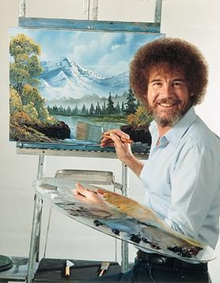

+++
author = "Alex Nuttall"
date = 2021-10-02
title = "Colour Mixing 🎨"
+++
A while ago I made this small Javascript [game](https://thick-hollins.github.io/mixhtml/) based on colour mixing. 

Someone attempting to mix two colours might just add two RGB values together. However...

`Coral + IndianRed =`
`rgb(255, 127, 80) + rgb(205, 92, 92) = rgb(255, 219, 172)`

<svg width="110" height="110">
  <rect width="100" height="100" style="fill:rgb(255,127,80);" />
</svg>
<svg width="110" height="110">
  <rect width="100" height="100" style="fill:rgb(205,92,92);" />
</svg>
<svg width="50" height="110">
  <rect width="50" height="100" style="fill:white;" />
</svg>
<svg width="110" height="110">
  <rect width="100" height="100" style="fill:rgb(255,219,172);" />
</svg>

From our typical experience of mixing paint, we expect these colours to produce some kind of orange, not this creamy colour, which [this website](https://colors.artyclick.com/color-name-finder/) matches to `NavajoWhite`. In the RGB colour system, higher values are lighter, so adding two dark colours together produces a lighter shade. There is nothing unnatural about this. If we imagine shining coloured spotlights onto the same spot on a white canvas, adding another spotlight would always make the spot lighter, no matter what colour the added light was. RGB colour is an additive colour model which works in such cases. 

In some cases, a simple average of the two colours produces a convincing mix, but in others, it produces unexpected results. To be able to produce a mixture of two colours as if we were mixing paint or ink, we need to use a subtractive colour model such as CMYK, which is what I did in the game. The named HTML colours which are the basis of the game are defined as RGB values and unfortunately, converting an RGB or hex colour to CMYK is not straightforward. Graphics software that does it doesn't depend on a single formula. However, a formula [found on the internet](https://www.rapidtables.com/convert/color/rgb-to-cmyk.html) gives a rough approximation, and it was possible to implement it in the game.

<svg width="110" height="110">
  <rect width="100" height="100" style="fill:rgb(255,127,80);" />
</svg>
<svg width="110" height="110">
  <rect width="100" height="100" style="fill:rgb(205,92,92);" />
</svg>
<svg width="50" height="110">
  <rect width="50" height="100" style="fill:white;" />
</svg>
<svg width="110" height="110">
  <rect width="100" height="100" style="fill:rgb(220,104,83);" />
</svg>

The final result has values `rgb(220, 104, 83)`. 